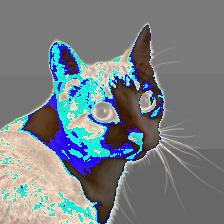
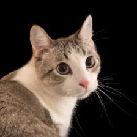
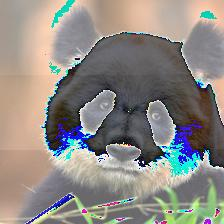

# Adversarial Noise Generator

## Targeted adversarial noise to image classifiers with Torch
### Objective
The primary goal of this project is to develop a sophisticated program capable of generating and applying adversarial noise to images. This noise is meticulously designed to deceive an image classification model, specifically the ResNet55 model, into misclassifying the altered images into a designated target class, irrespective of their original content.

### Methodology

1. Noise Generation: Initiate the process by generating random noise. This noise will be systematically overlaid on original images to create altered versions.
2. Model Testing: Utilize the ResNet55 model to classify the altered images, assessing their classification both as their original class and the intended target class. This step is crucial for evaluating the efficacy of the applied noise in deceiving the model.
3. Loss Function Creation: Develop a custom loss function that incorporates the probability scores of the two classifications. The formula for the loss function is defined as `-original class loss + target class loss`. This formulation aims to increase the likelihood of the target class while diminishing that of the original class.
4. Optimisation: Implement an optimisation strategy using an optimizer designed to minimize the loss function. This involves adjusting the adversarial noise to achieve the desired misclassification effect efficiently.
5. Iteration: Repeat the testing and optimization process iteratively until the loss function converges. Upon convergence, the adversarial noise is deemed successfully generated, having achieved the capability to prompt the ResNet55 model to misclassify the altered images as the target class.

### Current Progress
#### Update 07.04.2024
The adversarial noise appears in the places that seems more relevent to the object. The adversarial noise has altered the class of the original image. However, it's not the given target class. Besides, the noise is still too obvious for human eye. \

Main changes:
1. Adding closure gradient estimateion on optimiser. This approach would reestimate loss of function in every optimising step. It can bring a better learning result.
2. Inversig image transform for adversarial noise. To visualise the result.

Follow up of the previous improvement strategries:
1. **Loss Function Refinement**. CrossEntropy is a good way of estimate cattegory-based performace. I did not change it. However, I tried different ways of combining loss functions. The initial thought was to ignore the loss fuction of the origianl class and just minimise the target function loss. The optimiser ca focus on increasing the likelihood of the target class. The output images show the generator did not learn more effectively than using original combining loss function. \

#### Update 03.04.2024
The generator is up and creating adversarial noise, but there's a snag. The noise isn't fooling the classifier as effectively as hoped, and visually, it's too noticeable.
The adversarial noise appears in random areas which show the learning is not effective. 

Strategies for Improvement:

1. **Loss Function Refinement**:
    - Experiment with Different Loss Functions: Currently using `CrossEntropy`, it's time to test others that might be more suited for tricking classifiers.
    - Adjust the Loss Function Combination: Fine-tuning how different elements of the loss function are combined is necessary to produce more subtle yet effective noise.
2. **Minimize Noise Visibility**:
    Inspired by recent studies [1], the aim is to make the noise less detectable to the human eye. The challenge will be effectively using the clamp function alongside backpropagation.
3. **Optimiser Gradient Customisation**:
    Adjusting the gradient within the optimiser might help control the learning process better, leading to noise that's harder for classifiers to detect but still visually subtle. 

Reference:
[1] [Targeted adversalrial noise tutorial](https://pyimagesearch.com/2020/10/26/targeted-adversarial-attacks-with-keras-and-tensorflow/)
[2] [Generate advesarial nosie introduction](https://viso.ai/deep-learning/adversarial-machine-learning/#:~:text=An%20adversarial%20attack%20is%20a,valid%20input%20to%20a%20human.)
[3] [Intro of types of machine learing attack](https://towardsdatascience.com/how-to-attack-machine-learning-evasion-poisoning-inference-trojans-backdoors-a7cb5832595c)
[4] [Related paper](https://arxiv.org/pdf/1804.00792.pdf)

### Project To-Do List
- **Develop a Unified Model Class**: Aim to create a comprehensive Model class that accommodates various model libraries beyond just Torch. This class should have uniform attributes to facilitate easier application of internal methods.
- **Expand Noise Types**: Diversify the types of adversarial noise generated, including both targeted and untargeted variations. This will enhance the versatility and effectiveness of the noise in deceiving different classifiers.
- **Broaden Data and Task Types**: Extend the project's scope to include a wider array of data types and tasks. Implement new classes, such as those for image, video, sound, and text, that employ the same methods as the existing TargetedAdvNoiseGenerator. This expansion will enable the application of adversarial techniques across a broader spectrum of AI challenges.
- **Standardise Library Structure**: Reorganise the project to adhere to standard Python library conventions. This restructuring will make it straightforward to package these methods into a library. For guidance on packaging and distribution, refer to resources like "How to Publish a Python Package to PyPI" for comprehensive instructions.[how to publish a Python lib](https://towardsdatascience.com/how-to-publish-a-python-package-to-pypi-7be9dd5d6dcd)

### Instruction
1. Please download this repo to local
2. Create a new script in the same dir as adversarial_noise_generator.py
3. Import the script, `adversarial_noise_generator`. You can use use `TargetedAdvNoiseGenerator` and its methods.
4. initialise generator with model, image_url, target class index of Torch ResNet55. please check index map here 
5. Run the new script, it will display the altered image

Pleasde check example in `test_script.py` to see more details.

